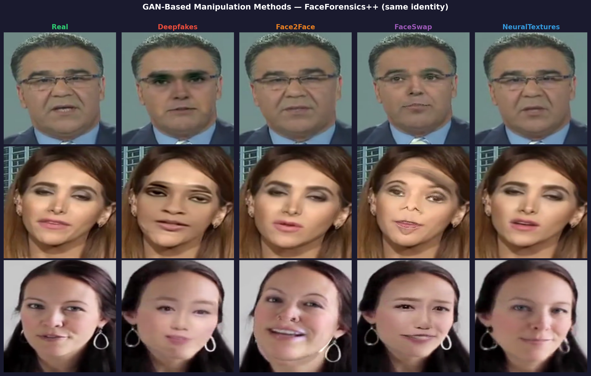
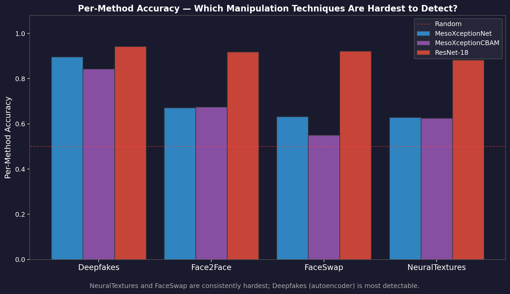
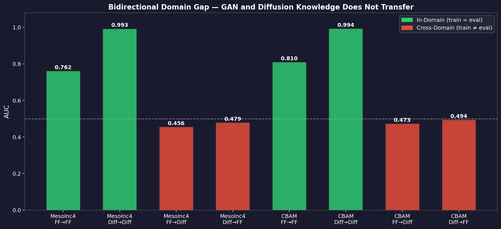
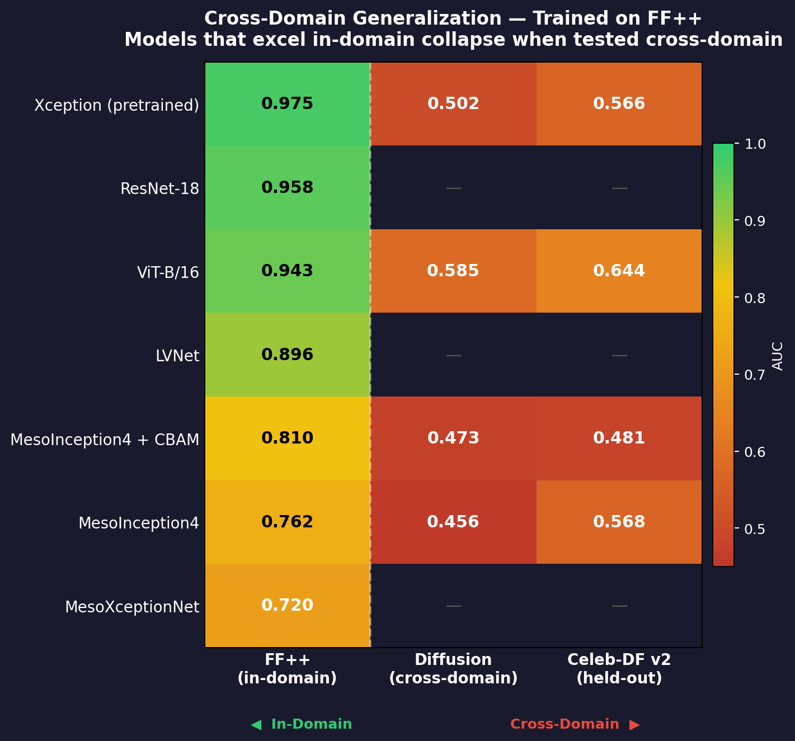

# Deepfake Detection: Beyond MEsonet4 - Benchmarking Modern DeepfakeDetection Across Generational Gaps

> **Course project — Deep Learning( (College of Aartificial Intelligence - 5205)*)*
> University of South Florida · Spring 2026

A research project studying how compact CNNs and large pretrained models detect AI-generated face forgeries — and whether detectors trained on one generation of fakes can generalise to the next.

We train MesoNet-family models **entirely from scratch** (no ImageNet weights) and compare them to fine-tuned Xception and ViT-B/16 foundation models, testing generalisation across three orthogonal forgery domains: GAN-based manipulations (FaceForensics++), diffusion-based synthesis (DiFF + DeepFakeFace), and a held-out cross-dataset benchmark (Celeb-DF v2).

---

## Deepfake Techniques and Generations

The central challenge in deepfake detection is that each generation of synthesis technology produces a **fundamentally different artifact class**. A detector trained on one generation will often fail silently on the next.

### Generation 1 — Encoder-Decoder Face Swaps (2017–2019)

The first mainstream deepfakes used a shared encoder / per-identity decoder autoencoder. A face is encoded into a shared latent space, then decoded using the target identity's decoder — the synthetic face region is composited onto the original frame.

**FaceForensics++ captures four methods from this era (evaluated in this project):**

| Method | How it works | Primary artifacts | Difficulty |
|---|---|---|:---:|
| **Deepfakes** | Shared encoder + per-identity decoder; blends synthetic face onto source frame | Blending seams at jaw/hairline, lighting discontinuities, warping distortion | Medium |
| **FaceSwap** | 3D mesh reconstruction + texture transfer; geometric face replacement | Resolution mismatches at splice boundary, skin tone inconsistencies | Medium |
| **Face2Face** | 3D morphable model tracks source expression, re-renders onto target without identity swap | Texture stitching at mouth/eye regions during re-rendering | Medium |
| **NeuralTextures** | Learns a neural texture conditioned on a 3D face model, renders to target pose | Subtle artifacts localised to mouth region only | **Hardest** |

The shared forensic signature of Generation 1 is **spatial locality** — artifacts cluster at blending boundaries and warped regions. CNNs with local receptive fields are inherently well-matched to detect these.


*Fig 1 — Real vs. each FF++ forgery method. Note the blending boundary in Deepfakes/FaceSwap and the subtle mouth artifacts in NeuralTextures.*


*Fig 10 — Per-method detection accuracy across all models. NeuralTextures is the hardest method for every architecture.*

---

### Generation 2 — Higher-Fidelity Commercial GANs (2019–2021)

Commercial pipelines added post-processing — colour correction, sharpening, and compression-aware blending — to eliminate the obvious blending seams of Gen 1.

**Celeb-DF v2** (held-out benchmark in this project) represents this generation. The forgeries are substantially more realistic than FF++ manipulations. Every model takes a large AUC hit on Celeb-DF v2 even though both datasets are GAN-based — demonstrating that improved post-processing alone breaks detectors that overfit to low-level blending artifacts.

---

### Generation 3 — Diffusion-Based Synthesis (2021–Present)

Diffusion models are a **fundamental paradigm shift**. Instead of encoding and compositing a face, they iteratively denoise a Gaussian noise signal conditioned on text prompts, reference images, or face embeddings. The face is synthesised **globally**, not spliced.

This wholesale change in mechanism produces an entirely different artifact class:

| Property | GAN-era (Gen 1–2) | Diffusion (Gen 3) |
|---|---|---|
| **Blending boundary** | Yes — detectable splice point | None — globally synthesised |
| **Spatial artifacts** | Localised at face edges, mouth, eyes | Distributed or absent |
| **Texture** | Warped/transferred from real image | Over-smooth, hyper-regularised skin |
| **Sensor noise** | Inherited from source video | Missing or inconsistent camera fingerprint |


*Fig 12 — Bidirectional domain gap: training on GAN data fails on diffusion fakes, and vice versa.*

**Diffusion methods evaluated:** Stable Diffusion 1.5 (text-to-image + inpainting), SDXL, SDXL-Refine, DreamBooth, Imagic, HPS, CoDiff, FreedomI, FreedomT, MidJourney.

The generalisation collapse — every GAN-trained model scores ≈0.47–0.50 AUC on diffusion fakes — directly demonstrates that the spatial artifacts learned from Gen 1 simply do not exist in Gen 3 outputs.


*Fig 8 — Cross-domain generalisation matrix. Near-chance AUC wherever training and evaluation domains differ.*

---

### Modern Deepfakes (2024 and Beyond)

| Technique | Description | What breaks existing detectors |
|---|---|---|
| **Video diffusion** (Sora, Runway Gen-3, Kling) | Temporally consistent video from text/image | Eliminates per-frame flickering; requires temporal analysis |
| **Audio-visual synthesis** (HeyGen, D-ID, ElevenLabs) | Face reenactment + voice cloning for fully synthetic video | Spatial-only detectors are irrelevant; need cross-modal consistency |
| **Real-time face swap** (DeepFaceLive, live filters) | Interactive-rate swap for live video calls | Artifacts are temporal aliasing/jitter, not spatial seams |
| **Identity fine-tuning** (DreamBooth, LoRA/SDXL) | Photorealistic specific-person likeness from <10 images | No consistent artifact pattern; near-indistinguishable from real |

Each generation introduces a new synthesis pathway with a new artifact class. This is why a single universal detector trained on prior data does not exist — and why cross-generation generalisation is the central open problem.

> For a deep dive into artifacts, CNN limitations, and recommended next steps, see [`docs/deepfake_techniques.md`](docs/deepfake_techniques.md).

---

## Key Results

### Cross-Dataset Generalisation

| Model | Train | Test | AUC | Acc | F1 |
|---|---|---|:---:|:---:|:---:|
| **MesoInception4 + CBAM** | FF++ | FF++ | **0.810** | 0.718 | 0.728 |
| MesoInception4 + CBAM | FF++ | Celeb-DF v2 | 0.481 | 0.489 | 0.557 |
| MesoInception4 + CBAM | FF++ | Diffusion | 0.473 | 0.472 | 0.306 |
| MesoInception4 + CBAM | Diffusion | Diffusion | **0.994**‡ | 0.953 | 0.952 |
| MesoInception4 + CBAM | Diffusion | FF++ | 0.495 | 0.496 | 0.007 |
| MesoInception4 (no CBAM) | FF++ | FF++ | 0.762 | 0.693 | 0.680 |
| MesoInception4 (no CBAM) | Diffusion | Diffusion | 0.993‡ | 0.947 | 0.947 |
| MesoXceptionNet | FF++ | FF++ | 0.720 | 0.647 | 0.667 |
| MesoXceptionNet + CBAM | FF++ | FF++ | 0.632 | 0.594 | 0.624 |
| **Xception (fine-tuned)** | FF++ | FF++ | **0.975** | 0.918 | 0.915 |
| Xception (fine-tuned) | FF++ | Celeb-DF v2 | 0.566 | 0.420 | 0.291 |
| Xception (fine-tuned) | FF++ | Diffusion | 0.502 | 0.481 | 0.342 |
| **ViT-B/16 (fine-tuned)** | FF++ | FF++ | **0.943** | 0.869 | 0.865 |
| ViT-B/16 (fine-tuned) | FF++ | Celeb-DF v2 | 0.644 | 0.404 | 0.202 |
| ViT-B/16 (fine-tuned) | FF++ | Diffusion | 0.585 | 0.542 | 0.350 |
| LVNet / Two-Stream Net | FF++ | FF++ | ~0.896† | — | — |
| LVNet / Two-Stream Net | Diffusion | Diffusion | ~0.998† | — | — |

*†LVNet results from validation-set training logs (epoch 29); held-out test evaluation pending full checkpoint upload.*
*‡Diffusion in-domain AUC is likely inflated by dataset construction bias — real images sourced from video frames (FF++, Celeb-DF) are visually distinct from still-image diffusion outputs at the dataset level. The model may be detecting image-source characteristics rather than forgery artifacts. See the conclusion section of the paper for full discussion.*

### Key Finding

> Compact CNNs and foundation models alike learn **forgery-method-specific** artifact patterns. A model trained on GAN fakes nearly **random-guesses** on diffusion fakes (AUC ≈ 0.47–0.50), and vice versa. This is the fundamental open challenge in deepfake detection.

---

## Models

Eight architectures are implemented in `src/models/`, all sharing a unified training and evaluation interface.

### Meso4 — Classic 4-Block MesoNet
> **Implemented by:** Hieu (Keras → PyTorch port)

The original MesoNet baseline from Afchar et al. (2018). Four convolutional blocks with progressively larger receptive fields, batch normalisation, and max-pooling. Minimal (~28K parameters), fast to train, and surprisingly competitive as a baseline.

```
Block 1: Conv(3→8,  3×3) + BN + ReLU + MaxPool(2)  →  128×128×8
Block 2: Conv(8→8,  5×5) + BN + ReLU + MaxPool(2)  →   64×64×8
Block 3: Conv(8→16, 5×5) + BN + ReLU + MaxPool(2)  →   32×32×16
Block 4: Conv(16→16,5×5) + BN + ReLU + MaxPool(4)  →    8×8×16
FC: Flatten → Dropout → Linear(1024→16) → LeakyReLU → Dropout → Linear(16→1)
~28K parameters
```

---

### MesoInception4 — Multi-Scale Inception Blocks
> **Implemented by:** rypow

Replaces the first two convolutional blocks with Inception modules that capture features at 1×1, 3×3, and dilated 3×3 (dilation=2 and 3) scales simultaneously. Better at detecting forgery artifacts that manifest across multiple spatial frequencies.

```
InceptionBlock 1: (1+4+4+2=11 ch) + BN + MaxPool(2)  →  128×128×11
InceptionBlock 2: (2+4+4+2=12 ch) + BN + MaxPool(2)  →   64×64×12
Conv1: 12→16, 5×5 + BN + MaxPool(2)                  →   32×32×16
Conv2: 16→16, 5×5 + BN + MaxPool(4)                  →    8×8×16
FC: 1024 → 16 → 1
~28K parameters
```

Results vs. Meso4: **+4.8 AUC points** on FF++ (0.762 vs ~0.71 baseline).

---

### MesoInception4 + CBAM — Attention-Enhanced (Best Compact CNN)
> **Implemented by:** rypow

Augments MesoInception4 with **CBAM (Convolutional Block Attention Module)** after every block. Channel attention recalibrates "which feature maps matter" and spatial attention recalibrates "where in the image to look." CBAM sits between batch norm and max-pooling so it operates at full spatial resolution before downsampling.

```
InceptionBlock → BN → CBAM → MaxPool   (×2)
     Conv → BN → ReLU → CBAM → MaxPool  (×2)
FC: 1024 → 16 → 1
~30K parameters (+6% vs MesoInception4)
```

CBAM adds a **Channel Attention** branch (global avg-pool + max-pool → shared MLP → sigmoid gate) and a **Spatial Attention** branch (channel avg + max concat → 7×7 Conv → sigmoid gate). The spatial gate is cached for Grad-CAM visualisation.

**Best single-dataset result:** AUC=0.810 on FF++ test set.

---

### MesoInception4 + CBAM Experimental — Wider Variant
> **Implemented by:** rypow

A wider version of the CBAM model with more channels per inception block, exploring capacity scaling. Used for ablation but did not consistently outperform the standard variant.

---

### MesoXceptionNet — Depthwise Separable Convolutions
> **Implemented by:** TJ

Replaces standard convolutions with **Xception-style depthwise separable convolutions**, reducing parameters by ~36% while maintaining receptive field size. Adds residual skip connections where input/output dimensions match.

```
Conv1:    Conv(3→8, 3×3) + BN + ReLU + MaxPool(2)              → 128×128×8
SepConv2: DepthSep(8→8,  5×5) + BN + ReLU + MaxPool(2) + skip  →  64×64×8
SepConv3: DepthSep(8→16, 5×5) + BN + ReLU + MaxPool(2)          →  32×32×16
SepConv4: DepthSep(16→16,5×5) + BN + ReLU + MaxPool(4) + skip   →   8×8×16
FC: 1024 → 16 → 1
~18K parameters (lightest model)
```

Per-method on FF++: **Deepfakes 89.6%** (best), Face2Face 67.1%, FaceSwap 63.2%, NeuralTextures 62.9%.

---

### MesoXceptionNet + CBAM
> **Implemented by:** TJ

Adds CBAM after batch norm in every block of MesoXceptionNet. Approximately +6% parameter overhead. The CBAM here uses a distinct lightweight implementation (`cbam.py`) compared to rypow's version (`cbam_module.py`).

---

### LVNet / Two_Stream_Net — Two-Stream Network (Locate and Verify)
> **Implemented by:** Hieu

An implementation of the **Locate and Verify** two-stream network (Zhong et al., ACM MM 2023). The largest and most complex model in the project at **62M parameters**.

**Architecture overview:**
- **Stream 1 (RGB):** Xception backbone processes the raw face image
- **Stream 2 (SRM):** Xception backbone processes SRM noise residuals (steganalysis filters that reveal compression/synthesis artifacts)
- **Cross-modal fusion at every stage:**
  - `CMCE` (Cross-Modal Channel Enhancement): cosine-similarity gating between streams
  - `LFGA` (Local Feature Global Attention): cross-attention from SRM stream onto RGB stream
- **MPFF** (Multi-scale Patch Feature Fusion): compresses multi-scale features to a fixed 19×19 grid
- **HdmProdBilinearFusion**: Hadamard-product fusion of multi-scale SRM features with the 2048-dim exit-flow features
- **Segmentation head**: localises forged regions at 19×19 resolution
- **Classification head**: 4096-dim pooled features → 2-class output

```
Input (B, 3, 299, 299)
  ├─ RGB Stream  (Xception entry/middle/exit flow)
  └─ SRM Stream  (Xception, fed with SRM residual maps)
       ↕ CMCE at 64ch, 128ch, 256ch stages
       ↕ LFGA  at 728ch stages (3×)
       ↓
  HdmProdBilinearFusion → cls_header → (B, 2) classification
  MPFF + concat         → seg_header → (B, 2, 19, 19) segmentation
  pro_header            → (B, 256, 19, 19) projection features
~62M parameters
```

LVNet is integrated via `LVNetWrapper` which converts the 2-class output to a single binary logit `(B, 1)` for compatibility with the shared training pipeline.

**Training:** Full LVNet training requires patch-level forgery annotations generated by `extension/prepare_data.py`. Hieu trained the model using a combination of cross-entropy classification loss and segmentation loss (weight 1.0) with the Adam optimiser (lr=5e-4).

---

## Ablation Study

Systematic ablation of MesoInception4 + CBAM, all evaluated on the FF++ test set (n=2,240).

| Configuration | AUC | Δ vs Best |
|---|:---:|:---:|
| **Full model** (CBAM + RRC + JPEG aug) | **0.810** | — |
| CBAM + RRC, no JPEG aug | 0.785 | −2.5 |
| No CBAM (baseline + RRC) | 0.762 | −4.8 |
| No geometric aug (no RRC) | 0.701 | −10.9 |
| CBAM + L2 regularisation (no RRC) | 0.666 | −14.4 |
| No dropout | 0.675 | −13.5 |
| No augmentation (resize only) | 0.577 | −23.3 |
| Epoch 100 (over-trained) | 0.638 | −17.2 |
| No batch normalisation | ~0.50 | collapsed |

**Key takeaways:**
- **Augmentation is the largest driver:** removing all augmentation collapses AUC by 23 points. RandomResizedCrop alone recovers most of the loss.
- **CBAM contributes a consistent +4.8 AUC points** over the same architecture without attention.
- **JPEG augmentation** adds robustness (+2.5 points) by simulating real-world compression.
- **Batch normalisation is critical** — removing it causes training to diverge.
- **Longer training can hurt:** running to 100 epochs without early stopping degrades AUC by 17 points due to overfitting.

---

## Generalisation Analysis

The central finding of this project is that **no model generalises across forgery types**:

```
                     Evaluate on:
Train on:      FF++    CelebDFv2   Diffusion
─────────────────────────────────────────────
FF++           0.810   0.481       0.473   ← AUC (CBAM model)
Diffusion      0.495   —           0.994
─────────────────────────────────────────────
Xception       0.975   0.566       0.502   ← fine-tuned
ViT-B/16       0.943   0.644       0.585
```

Foundation models (Xception, ViT) achieve higher in-distribution AUC but **do not generalise better** to unseen forgery types. The cross-dataset (Celeb-DF) and cross-method (Diffusion) AUCs for all models converge near chance (0.47–0.65), confirming that detectors overfit to generation-specific artifacts.

---

## Installation

**Requirements:** Python 3.12, CUDA 11.8+

```bash
git clone https://github.com/YOUR_USERNAME/deepfake-detection
cd deepfake-detection
pip install -r requirements.txt
```

---

## Repository Structure

```
deepfake-detection/
├── src/
│   ├── train.py                          # Unified training script (all models)
│   ├── eval.py                           # Evaluation + metrics + plots
│   ├── gradcam.py                        # Model-agnostic Grad-CAM
│   ├── visualize.py                      # Attention map + Grad-CAM overlays
│   └── models/
│       ├── __init__.py                   # MODEL_REGISTRY + GRAD_CAM_LAYERS
│       ├── meso4.py                      # Meso4 baseline
│       ├── meso_inception_base.py        # MesoInception4
│       ├── mesoinception_cbam.py         # MesoInception4 + CBAM  ← best compact CNN
│       ├── mesoinception_cbam_experimental.py  # Wider CBAM variant
│       ├── cbam_module.py               # CBAM with Grad-CAM spatial gate
│       ├── meso_xception.py             # MesoXceptionNet
│       ├── meso_xception_cbam.py        # MesoXceptionNet + CBAM
│       ├── cbam.py                      # Lightweight CBAM for Xception variant
│       └── lvnet.py                     # Two-Stream LVNet (self-contained)
├── results/
│   ├── ablation.csv                     # Ablation summary (all 17 runs)
│   ├── ablation_results.csv             # Detailed per-run metrics
│   ├── comparison_summary.json          # Multi-model comparison on FF++
│   ├── mesoinception4/                  # MesoInception4 eval JSONs + Grad-CAM
│   ├── mesoinception4_cbam/             # CBAM model eval JSONs + Grad-CAM
│   ├── xception/                        # Xception eval JSONs
│   └── vit/                             # ViT eval JSONs
├── figures/                             # All visualisations (generated by scripts/)
│   ├── fig1_ff_comparison.png           # Real vs 4 GAN methods
│   ├── fig4_error_maps.png              # Pixel-level error maps (spatial artifacts)
│   ├── fig5_diffusion_examples.png      # Diffusion method examples
│   ├── fig7_model_zoo.png               # All models ranked by AUC
│   ├── fig8_generalization_heatmap.png  # Cross-domain generalisation matrix
│   ├── fig9_domain_gap.png              # In-domain vs cross-domain AUC
│   ├── fig10_per_method_accuracy.png    # Per-method accuracy breakdown
│   ├── fig11_ablation.png               # Ablation study chart
│   ├── fig12_bidirectional_gap.png      # GAN↔Diffusion domain gap
│   ├── poster_gan_methods.png           # Social media poster: GAN methods
│   ├── poster_gan_vs_diffusion.png      # Social media poster: GAN vs Diffusion
│   └── poster_4panel_forensics.png      # Forensic 4-panel poster
├── scripts/
│   └── generate_figures.py             # Regenerate all figures from raw data
├── paper/
│   ├── main.pdf                         # Full paper (PDF)
│   ├── main.tex                         # LaTeX source
│   └── references.bib                   # Bibliography
├── huggingface_upload_weights.md        # Guide for downloading pretrained weights
└── requirements.txt
```

---

## Training

Run from the `src/` directory. All models share the same training script.

Manifests (JSON files listing image paths and labels) are generated during dataset preprocessing. See the **Datasets** section below for how to prepare your data.

```bash
cd src

# --- Best compact CNN: MesoInception4 + CBAM ---
python train.py \
  --train_manifest /path/to/manifests/FF++/train_frames.json \
  --val_manifest   /path/to/manifests/FF++/val_frames.json \
  --model          mesoinception4_cbam \
  --epochs         50 \
  --batch_size     64 \
  --lr             1e-3 \
  --output_dir     ../checkpoints/meso_cbam_run

# --- MesoXceptionNet ---
python train.py \
  --train_manifest /path/to/manifests/FF++/train_frames.json \
  --val_manifest   /path/to/manifests/FF++/val_frames.json \
  --model          meso_xception \
  --epochs         50 \
  --batch_size     64 \
  --lr             1e-3 \
  --output_dir     ../checkpoints/meso_xception_run

# --- Fine-tune ViT-B/16 (recommended settings) ---
python train.py \
  --train_manifest /path/to/manifests/FF++/train_frames.json \
  --val_manifest   /path/to/manifests/FF++/val_frames.json \
  --model          vit_b16 \
  --epochs         30 \
  --lr             2e-5 \
  --weight_decay   0.1 \
  --output_dir     ../checkpoints/vit_run

# --- Fine-tune Xception ---
python train.py \
  --train_manifest /path/to/manifests/FF++/train_frames.json \
  --val_manifest   /path/to/manifests/FF++/val_frames.json \
  --model          xception_pretrained \
  --epochs         30 \
  --lr             1e-4 \
  --output_dir     ../checkpoints/xception_run
```

**Available `--model` options:**

| Key | Description | Input | Params |
|---|---|---|---|
| `meso4` | Meso4 baseline [Hieu] | 256×256 | 28K |
| `mesoinception4` | MesoInception4 [rypow] | 256×256 | 28K |
| `mesoinception4_cbam` | MesoInception4 + CBAM [rypow] | 256×256 | 30K |
| `mesoinception4_cbam_experimental` | Wider CBAM variant [rypow] | 256×256 | ~45K |
| `meso_xception` | MesoXceptionNet [TJ] | 256×256 | 18K |
| `meso_xception_cbam` | MesoXceptionNet + CBAM [TJ] | 256×256 | 19K |
| `lvnet` | LVNet Two-Stream Net [Hieu] | 299×299 | 62M |
| `xception_pretrained` | Pretrained Xception (timm) | 256×256 | ~23M |
| `vit_b16` | Pretrained ViT-B/16 (timm) | 224×224 | ~86M |

> **ViT fine-tuning note:** Use `--lr 2e-5` (default 1e-3 destroys attention weights) and `--weight_decay 0.1`.
>
> **LVNet note:** Full training requires forgery segmentation annotations and the original LVNet training pipeline. The shared `train.py` supports LVNet for inference and classification-head fine-tuning only.

---

## Evaluation

```bash
cd src

# Evaluate on FF++ test set
python eval.py \
  --manifest      /path/to/manifests/FF++/test_frames.json \
  --checkpoint    ../checkpoints/best_model.pth \
  --model_arch    mesoinception4_cbam \
  --output_dir    ../evaluation_results/FF++_test \
  --batch_size    64

# Cross-dataset: evaluate FF++-trained model on Celeb-DF v2
python eval.py \
  --manifest      /path/to/manifests/celeb-dfv2/test_frames.json \
  --checkpoint    ../checkpoints/best_model.pth \
  --model_arch    mesoinception4_cbam \
  --output_dir    ../evaluation_results/celebdf_test

# Evaluate LVNet (handles {'state_dict': ...} checkpoint format automatically)
python eval.py \
  --manifest      /path/to/manifests/FF++/test_frames.json \
  --checkpoint    ../checkpoints/lvnet_best.pth.tar \
  --model_arch    lvnet \
  --output_dir    ../evaluation_results/lvnet_FF
```

Each run saves:
- `eval_results.json` — AUC, accuracy, precision, recall, F1, per-method breakdown
- `confusion_matrix.png`
- `roc_curve.png`
- `per_method_accuracy.png`

---

## Visualisation (Grad-CAM + Attention Maps)

```bash
cd src

python visualize.py \
  --manifest      /path/to/manifests/FF++/test_frames.json \
  --checkpoint    ../checkpoints/best_model.pth \
  --model_arch    mesoinception4_cbam \
  --output_dir    ../eval_viz/gradcam_results \
  --n_samples     20 \
  --mode          both
```

Mode options: `gradcam` | `attention` | `both`

Grad-CAM target layers are configured per architecture in `src/models/__init__.py::GRAD_CAM_LAYERS`.

---

## Datasets

| Dataset | Type | Forgery Methods | Split Used | Size |
|---|---|---|---|---|
| **FaceForensics++** | GAN-based | Deepfakes, Face2Face, FaceSwap, NeuralTextures | train / val / test | ~16K frames |
| **DiFF** | Diffusion | SD1.5 T2I, Inpainting, SDXL, DreamBooth, Imagic, HPS | test | ~4K frames |
| **DeepFakeFace** | Diffusion | SD1.5 T2I, SD Inpainting | test | ~3.6K frames |
| **Celeb-DF v2** | GAN-based (held out) | Commercial deepfakes | test only | ~16.5K frames |

All images are 256×256 face crops (299×299 for LVNet). No image with shortest side < 256px is included — upscaling is never applied.

**Preprocessing:** FF++ frames are extracted from raw videos using MTCNN face detection and resized to 256×256. Diffusion datasets are assembled from [DiFF](https://github.com/xaCheng1996/DiFF) and [DeepFakeFace](https://github.com/OpenRL-Lab/DeepFakeFace), filtered to exclude images below 256px on the shortest side. Both pipelines produce JSON manifests consumed by `train.py` and `eval.py`.

---

## Contributors

| Person | Contributions |
|---|---|
| **rypow** | MesoInception4, MesoInception4+CBAM, CBAM module with Grad-CAM cache, ablation study (17 runs), cross-dataset evaluation pipeline, diffusion dataset assembly |
| **TJ** | MesoXceptionNet, MesoXceptionNet+CBAM, depthwise separable conv variants, comparative evaluation |
| **Hieu** | Meso4 (Keras→PyTorch port), LVNet/Two-Stream-Net training, LVNet evaluation scripts, data preparation pipeline |

---

## References

- Afchar et al., *"MesoNet: a Compact Facial Video Forgery Detection Network"*, WIFS 2018 — [arXiv:1809.00888](https://arxiv.org/abs/1809.00888)
- Woo et al., *"CBAM: Convolutional Block Attention Module"*, ECCV 2018 — [arXiv:1807.06521](https://arxiv.org/abs/1807.06521)
- Chollet, *"Xception: Deep Learning with Depthwise Separable Convolutions"*, CVPR 2017 — [arXiv:1610.02357](https://arxiv.org/abs/1610.02357)
- Dosovitskiy et al., *"An Image is Worth 16×16 Words: Transformers for Image Recognition"*, ICLR 2021 — [arXiv:2010.11929](https://arxiv.org/abs/2010.11929)
- Rössler et al., *"FaceForensics++: Learning to Detect Manipulated Facial Images"*, ICCV 2019 — [arXiv:1901.08971](https://arxiv.org/abs/1901.08971)
- Li et al., *"Celeb-DF: A Large-scale Challenging Dataset for DeepFake Video Detection"*, CVPR 2020
- Cheng et al., *"DiFF: Diverse Facial Forgery Dataset"*, 2023 — [GitHub](https://github.com/xaCheng1996/DiFF)
- Zhong et al., *"Locate and Verify: A Two-Stream Network for Improved Deepfake Detection"*, ACM MM 2023 — [arXiv:2309.11131](https://arxiv.org/abs/2309.11131) · [GitHub](https://github.com/sccsok/Locate-and-Verify)
