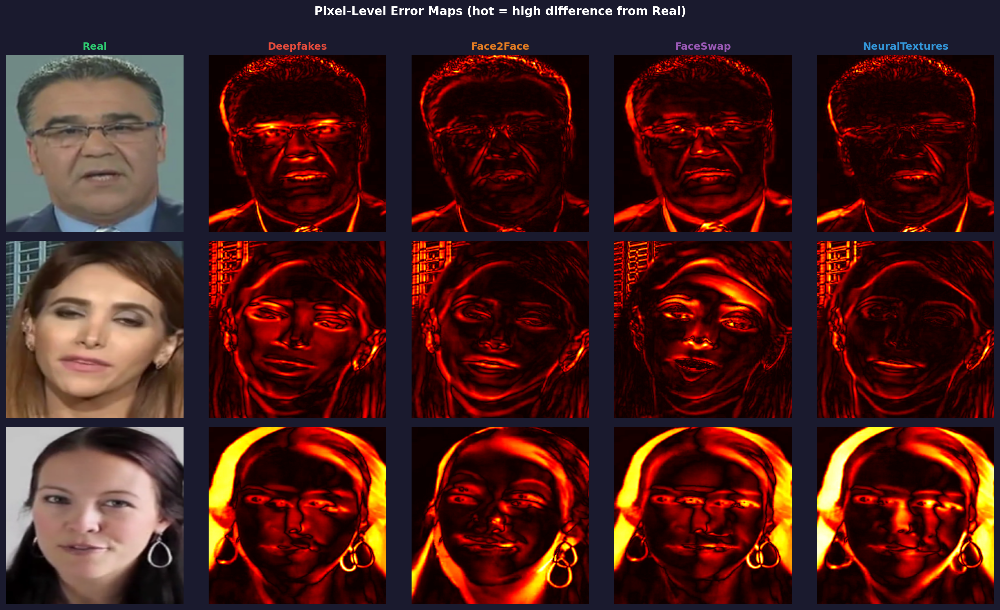
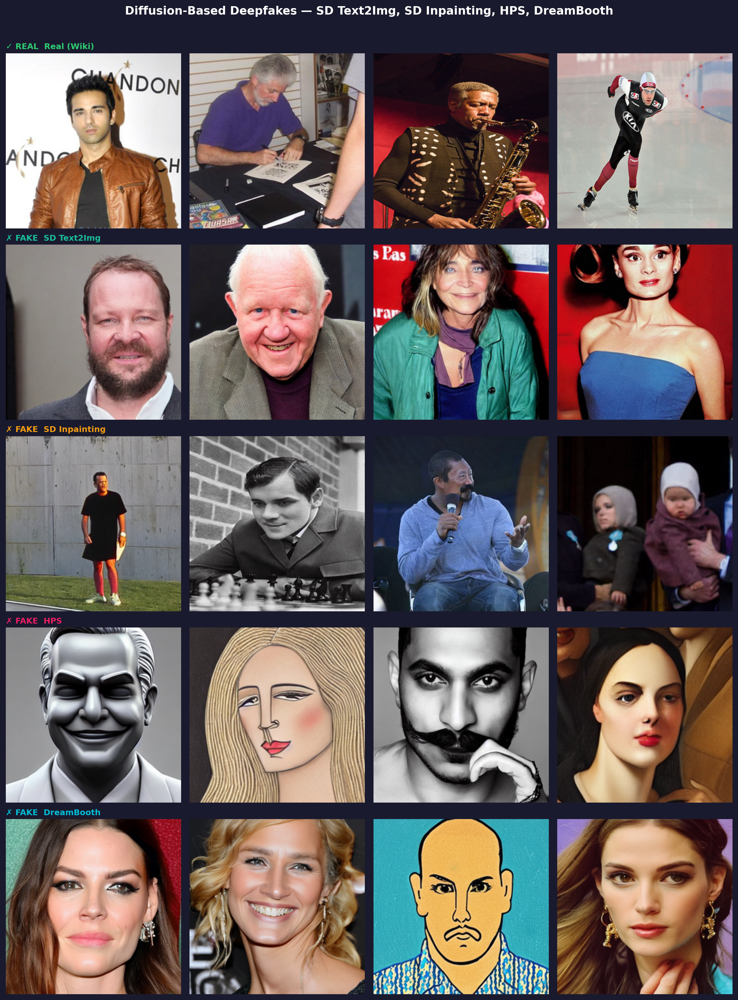
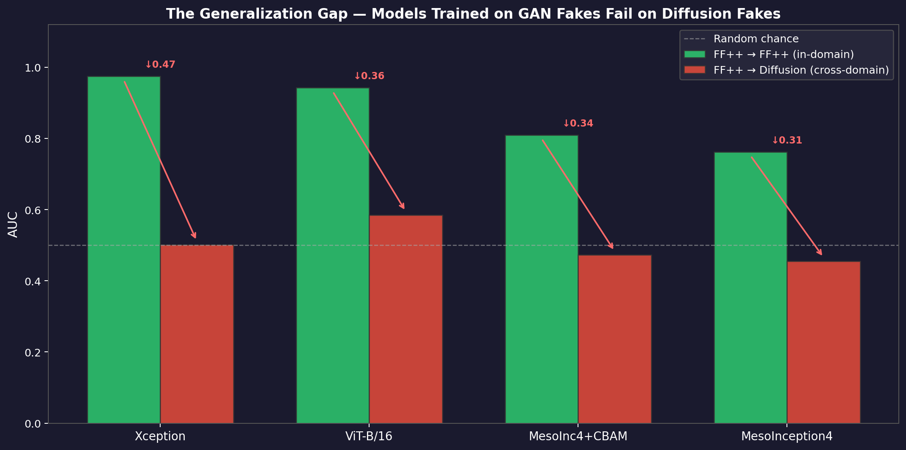

# Deepfake Techniques, Generations, and the Detection Challenge

This document provides an in-depth explanation of how each deepfake technique works, the forensic artifacts it leaves, why CNN-based detectors struggle to generalise, and a roadmap for investigating modern deepfakes and building more robust defenses.

---

## Table of Contents

1. [What Is a Deepfake?](#what-is-a-deepfake)
2. [Generation 1 — Encoder-Decoder Face Swaps (2017–2019)](#generation-1--encoder-decoder-face-swaps-20172019)
   - [Deepfakes (identity swap)](#deepfakes-identity-swap)
   - [FaceSwap](#faceswap)
   - [Face2Face](#face2face)
   - [NeuralTextures](#neuraltextures)
3. [Generation 2 — Commercial-Quality GANs (2019–2021)](#generation-2--commercial-quality-gans-20192021)
   - [Celeb-DF v2](#celeb-df-v2)
4. [Generation 3 — Diffusion-Based Synthesis (2021–Present)](#generation-3--diffusion-based-synthesis-2021present)
   - [How Diffusion Models Work](#how-diffusion-models-work)
   - [Stable Diffusion and Variants](#stable-diffusion-and-variants)
   - [Why the Artifact Class Is Fundamentally Different](#why-the-artifact-class-is-fundamentally-different)
5. [Modern Deepfakes (2024 and Beyond)](#modern-deepfakes-2024-and-beyond)
6. [Artifact Comparison Across Generations](#artifact-comparison-across-generations)
7. [Why CNNs Fail to Generalise](#why-cnns-fail-to-generalise)
8. [Figure Guide: What Each Visualisation Shows](#figure-guide-what-each-visualisation-shows)
9. [Missing Figures: Recommendations](#missing-figures-recommendations)
10. [Next Steps: Research Roadmap](#next-steps-research-roadmap)

---

## What Is a Deepfake?

A deepfake is any synthetic or manipulated media — image, video, or audio — in which a person's likeness has been altered or fabricated using machine learning. The term originated from the Reddit community "r/deepfakes" (2017), but the underlying technology now spans three distinct generations with fundamentally different synthesis mechanisms and forensic signatures.

The key insight driving this entire research area:

> **Every synthesis method leaves artifacts. But the artifact class changes with each generation. A detector that learns generation N's artifacts will fail silently on generation N+1.**

---

## Generation 1 — Encoder-Decoder Face Swaps (2017–2019)

### How the Architecture Works

The first generation uses **shared encoder / per-identity decoder autoencoders**:

```
Training:
  Encoder (shared) → Latent space ← Encoder (shared)
  Decoder_A (identity A)              Decoder_B (identity B)

Inference (swapping A into B's video):
  Frame of A → Encoder → Latent → Decoder_B → Synthetic face of A with B's expressions
  Synthetic face then COMPOSITED onto original B frame (alpha blending / Poisson blending)
```

The compositing step is the critical detail — the synthetic face is **pasted onto** a real video frame. This splice is the root cause of Generation 1 artifacts.

---

### Deepfakes (identity swap)

**Synthesis:** Autoencoder pair with shared encoder. The synthetic face is blended onto the source video using colour correction and alpha blending.

**Artifacts:**
- **Blending seams** along the jaw, hairline, and ear boundary where synthetic face meets the real neck/background
- **Lighting discontinuities** — the decoder reconstructs lighting from training data which may not match the source video's lighting direction
- **Warping distortion** at the face periphery, visible as unnatural skin stretching
- **Temporal flickering** in video — per-frame independent synthesis produces frame-to-frame inconsistency

**Forensic signature:** The error map (pixel-wise difference between real and compressed reconstruction) shows elevated residuals at the face boundary ring.


*Above: Real face alongside the four FF++ forgery methods. The Deepfakes column shows the characteristic boundary ring artifact.*


*Above: Pixel-level error maps. Deepfakes and FaceSwap show strong residuals at the face boundary; NeuralTextures shows diffuse, low-amplitude errors.*

**Detection difficulty:** Medium. The blending boundary produces a strong spatial signal that even compact CNNs (MesoNet, MesoInception4) can detect. Per-method accuracy in this project: ~84–86% for best models.

---

### FaceSwap

**Synthesis:** 3D face mesh reconstruction from both source and target, followed by texture transfer and Poisson blending. The face geometry is replaced geometrically rather than through an autoencoder.

**Artifacts:**
- **Resolution mismatch** between the synthetic face texture (often lower resolution than the background) and surrounding skin
- **Colour/skin tone inconsistency** at the splice boundary
- **Geometric distortion** around the chin and temples where 3D mesh alignment is imperfect

**Detection difficulty:** Medium. The boundary artifact is similar to Deepfakes. Xception achieves 94.6% per-method accuracy; MesoInception4-CBAM achieves 71.4%.

---

### Face2Face

**Synthesis:** Does **not** swap identity. Instead, uses a 3D Morphable Model (3DMM) to track the source actor's expression parameters (mouth opening, eyebrow position, gaze) and retargets them onto the target video through neural re-rendering.

**Why this matters:** The face identity is preserved, only the expression changes. There is no full-face composite — only the expression-driven regions are re-rendered.

**Artifacts:**
- **Texture stitching** at the mouth and eye boundaries where the re-rendered region meets the original
- **Colour gradient discontinuity** around the inner lip/teeth area
- **Subtle sharpness mismatch** between re-rendered regions (often sharper) and the surrounding face (subject to video compression)

**Detection difficulty:** Medium-low. The re-rendered region is smaller than a full face swap, but the boundary is still detectable. Best model (Xception): ~89.6% per-method.

---

### NeuralTextures

**Synthesis:** The most sophisticated Gen 1 method. Learns a **neural texture map** — a latent image texture conditioned on a 3D face model — and renders it by warping to the target pose using a differentiable renderer. Only the texture in the rendered region is modified.

**Artifacts:**
- **Mouth region artifacts** — the synthesis is localised to the mouth and is tuned to be perceptually seamless, but subtle texture inconsistencies remain
- **Very low spatial amplitude** — artifacts are often below the detection threshold of simple CNNs and near human perceptual limits
- **No blending boundary** for the face overall — only the rendered region

This is why NeuralTextures is the hardest method in the dataset:

| Model | NeuralTextures Accuracy |
|---|:---:|
| Xception (fine-tuned) | 81.1% |
| ViT-B/16 (fine-tuned) | 71.1% |
| MesoInception4-CBAM | 65.4% |
| MesoInception4 | 56.4% |

NeuralTextures is a bridge between Generation 1 and diffusion: it generates texture rather than blending, producing artifacts that are distributed rather than localised at boundaries.

---

## Generation 2 — Commercial-Quality GANs (2019–2021)

### Celeb-DF v2

**What changed:** Commercial deepfake pipelines added post-processing stages that eliminate the most obvious Gen 1 artifacts:
- **Colour correction** to match source and target skin tones
- **Temporal smoothing** to remove per-frame flickering
- **Compression-aware blending** to hide seams after video encoding

**Result:** Forgeries that pass casual human inspection and defeat detectors trained only on FF++ artifacts.

**This project's finding:** Every model trained on FF++ collapses on Celeb-DF v2:

| Model | FF++ AUC | Celeb-DF v2 AUC | Drop |
|---|:---:|:---:|:---:|
| ViT-B/16 | 0.943 | 0.644 | −0.299 |
| Xception | 0.975 | 0.566 | −0.409 |
| MesoInception4-CBAM | 0.810 | 0.481 | −0.329 |

The AUC drop is large even though both datasets use GAN-based methods — the post-processing pipeline alone is enough to break detectors that overfit to low-level blending artifacts.

---

## Generation 3 — Diffusion-Based Synthesis (2021–Present)

### How Diffusion Models Work

Diffusion models are conceptually different from autoencoders and GANs:

```
Training:
  Real image x₀ → add noise progressively → xₜ (pure Gaussian noise)
  Train denoising network ε_θ to predict the noise added at each step

Inference:
  Start from xₜ ~ N(0, I)  (pure noise)
  Iteratively denoise: xₜ → xₜ₋₁ → ... → x₀  (synthetic image)
  Conditioning: text prompt / face embedding / reference image guides each step
```

**Critical difference from Gen 1:** There is **no compositing step**. The entire output image is synthesised from noise. There is no "real" frame being modified — the synthetic content is the entire image.

### Stable Diffusion and Variants

The diffusion methods evaluated in this project cover multiple conditioning strategies:

| Method | Conditioning | What it does |
|---|---|---|
| **SD 1.5 text-to-image** | Text prompt | Generates a face from a text description |
| **SD Inpainting** | Image + mask + text | Replaces a face region within an existing image |
| **SDXL** | Text prompt (larger model) | Higher resolution, better photorealism |
| **SDXL-Refine** | SDXL base + refiner | Two-stage generation for sharper output |
| **DreamBooth** | Fine-tuned on specific person | Generates new images of that individual |
| **Imagic** | Real image + target text | Edits a specific real photo toward a text description |
| **HPS** | Human preference score guidance | Guidance toward aesthetically preferred outputs |
| **CoDiff / FreedomT / FreedomI** | Various | Advanced guidance and control strategies |
| **MidJourney** | Text prompt (proprietary) | Commercial photorealistic generation |


*Above: Example images from each diffusion method in the dataset. Note the high photorealism and absence of blending seams.*

---

### Why the Artifact Class Is Fundamentally Different

| Property | Generation 1–2 (GAN) | Generation 3 (Diffusion) |
|---|---|---|
| **Compositing** | Yes — real frame + synthetic region | No — entire image synthesised |
| **Blending boundary** | Present, detectable by CNNs | Absent |
| **Spatial artifacts** | Localised at face edges | None or diffuse |
| **Texture** | Warped from real image, may have warping distortion | Over-smooth, hyper-regularised, lacks micro-texture |
| **Temporal consistency** | Per-frame synthesis, flickering | Generated independently per image |
| **Sensor noise** | Inherited from source video camera | Missing or inconsistent imaging fingerprint |
| **Identity source** | Encoded from real training images | Learned from billions of internet images |

**The generalisation collapse:**


*Above: Cross-domain generalisation matrix. Near-chance AUC appears wherever training and evaluation domains differ — every cell off the diagonal collapses.*


*Above: GAN→Diffusion and Diffusion→GAN domain gaps are symmetric and severe — confirming these are orthogonal artifact spaces, not a spectrum.*

---

## Modern Deepfakes (2024 and Beyond)

### Video Diffusion (Sora, Runway Gen-3, Kling, Pika)

**How it works:** Extends latent diffusion into the temporal dimension. Instead of synthesising independent frames, the model jointly denoises a spatiotemporal volume, producing videos with natural motion and temporal coherence.

**Why current detectors fail:**
- Per-frame flickering (historically a strong cue) is eliminated by temporal consistency constraints
- Single-frame spatial detectors cannot exploit temporal inconsistency if none exists
- Detectors need optical flow analysis, temporal attention, or 3D convolution over frame sequences

---

### Audio-Visual Synthesis (HeyGen, D-ID, ElevenLabs + Video)

**How it works:** Combines a face reenactment model (drives lip sync and expression from an audio signal) with a neural voice cloning system (generates a target person's voice from reference audio). The result is a fully synthetic "video call" or interview.

**Why current detectors fail:**
- The face may or may not contain spatial artifacts — detectors cannot rely on visual analysis alone
- The attack surface is multi-modal: even a visually authentic face with a cloned voice constitutes a deepfake
- Detection requires audio-visual consistency analysis (lip-sync accuracy, audio spectral fingerprints, cross-modal coherence)

---

### Real-Time Face Swap (DeepFaceLive, Live Filters)

**How it works:** Lightweight encoder-decoder or GAN optimised for interactive-rate (25–30 fps) inference. Runs during live video calls (Zoom, Teams, etc.) to replace the user's face in real time.

**Artifacts:** Dominated by latency-induced jitter and temporal aliasing rather than spatial blending errors. When the user moves quickly, the face swap lags, producing a brief desync between the background body motion and the synthetic face.

**Why current detectors fail:** Training datasets are captured from offline deepfake videos, not live-stream artifacts. The temporal jitter signature requires high-frame-rate analysis and is absent from still-image detectors.

---

### Identity Fine-Tuning (DreamBooth, LoRA/SDXL)

**How it works:** Fine-tunes a large diffusion model on 5–20 images of a specific person. The resulting model generates unlimited photorealistic images of that individual in arbitrary contexts, poses, and lighting.

**Why current detectors fail:**
- No blending boundary
- No consistent artifact pattern — output quality is photorealistic and perceptually seamless
- Each fine-tune creates a slightly different artifact fingerprint; no generalisation across fine-tunes
- Emerging approach: detect the absence of expected camera sensor noise (photo response non-uniformity)

---

## Artifact Comparison Across Generations

The figure below captures all of the above in one place:


*Above: In-domain vs. cross-domain AUC for all models. The gap between in-domain and cross-domain performance quantifies how much each model has overfit to generation-specific artifacts.*

A useful mental model: imagine a spectrum from **spatially localised, high-amplitude artifacts** (Gen 1) to **globally distributed, low-amplitude or absent artifacts** (Gen 3+). CNN-based detectors are optimised for the left end of this spectrum. Modern deepfakes live at the right end.

```
Artifact detectability →
Low                                                  High
┌─────────────────────────────────────────────────────────┐
│ Video     Identity   Audio-    Diffusion  Celeb-  FF++  │
│ Diffusion Fine-tune  Visual    SD/SDXL    DF v2   GAN   │
│ (2024)    (2024)     (2023)    (2021)     (2020)  (2019)│
└─────────────────────────────────────────────────────────┘
     ← Modern deepfakes               Gen 1 artifacts →
```

CNN detectors are effective at the right end and fail at the left end.

---

## Why CNNs Fail to Generalise

### 1. CNNs Learn the Artifact, Not the Concept of "Fake"

A CNN trained on FF++ does not learn "this face was synthesised" — it learns "this image has blending-boundary texture patterns consistent with FaceSwap/Deepfakes compositing." When the synthesis method changes, the artifact changes, and the CNN's learned filters have no signal.

Evidence from this project: MesoInception4-CBAM trained on Diffusion and evaluated on FF++ achieves **recall of 0.009** — it predicts nearly everything as real. The model learned diffusion spectral fingerprints and assigns zero probability of fake to anything without those fingerprints.

### 2. Local Receptive Fields Miss Global Cues

CNNs process images through stacked local filters. Their receptive fields, while growing with depth, remain fundamentally local. Diffusion fakes and modern video deepfakes leave:
- **Global consistency violations** (lighting direction inconsistent across the frame)
- **Physical implausibilities** (reflections that don't match lighting, shadows pointing the wrong direction)
- **Spectral fingerprints distributed across the entire frequency spectrum**

These require either:
- Very large receptive fields (expensive for compact CNNs)
- Global attention mechanisms (ViT, cross-attention)
- Explicit frequency-domain analysis (SRM filters, DCT feature extractors)

Even ViT-B/16 with global self-attention does not solve the problem in this project — it achieves 0.585 AUC on diffusion fakes when trained on GAN fakes. Global attention helps, but the features being attended to are still generation-specific.

### 3. Overfitting Scales with Model Capacity

Counter-intuitively, **larger models overfit more severely** to generation-specific artifacts:

| Model | Params | FF++-trained, Celeb-DF v2 Fake Recall |
|---|:---:|:---:|
| ViT-B/16 | 86M | **11.5%** — almost completely blind to unseen fakes |
| Xception | 22.9M | 18.2% |
| MesoInception4-CBAM | 28K | 49.0% — closer to random |

Larger models learn more nuanced and precise artifact patterns from the training distribution, which means they are more brittle when that distribution shifts. Compact models with limited capacity learn coarser features that partially transfer.

This suggests that for generalisation, **model capacity alone is not the answer** — what matters is whether the model is learning features that are invariant across synthesis methods.

### 4. No Temporal Awareness

Still-image CNN detectors, including every model in this project, evaluate each frame independently. This misses:
- Temporal flickering between frames (detectable with 3D convolutions or optical flow)
- Audio-visual desync (requires cross-modal training)
- Temporal coherence artifacts in early video diffusion models

### 5. Augmentation Does Not Solve Domain Shift

This project shows that augmentation (JPEG compression, Gaussian blur, colour jitter) significantly improves in-domain robustness but does not improve cross-generation generalisation. Augmentation diversifies the training distribution within a generation but cannot simulate a different synthesis paradigm.

---

## Figure Guide: What Each Visualisation Shows

| Figure | File | What it shows | Best used for |
|---|---|---|---|
| Fig 1 | `fig1_ff_comparison.png` | Real face vs. all 4 FF++ methods side-by-side | Explaining Gen 1 artifact differences |
| Fig 4 | `fig4_error_maps.png` | Pixel-level error maps per FF++ method | Visualising where and how strongly each method leaves spatial artifacts |
| Fig 5 | `fig5_diffusion_examples.png` | Example images from each diffusion technique | Showing the variety and quality of Gen 3 fakes |
| Fig 7 | `fig7_model_zoo.png` | All models ranked by AUC | Architecture comparison overview |
| Fig 8 | `fig8_generalization_heatmap.png` | Cross-domain generalisation matrix (heatmap) | Visualising the full generalisation collapse |
| Fig 9 | `fig9_domain_gap.png` | In-domain vs. cross-domain AUC per model | Showing how much each model overfits |
| Fig 10 | `fig10_per_method_accuracy.png` | Per-method accuracy: Deepfakes, FaceSwap, Face2Face, NeuralTextures, Real | Understanding which methods are hardest |
| Fig 11 | `fig11_ablation.png` | Ablation: MesoInception4-CBAM component contributions | Understanding what drives performance |
| Fig 12 | `fig12_bidirectional_gap.png` | GAN→Diffusion and Diffusion→GAN gaps | Showing the domain gap is symmetric and severe |
---

## Next Steps: Research Roadmap

The following is an ordered investigation roadmap for extending this work toward robust detection of modern deepfakes.

---

### Phase 1 — Fix the Data Foundation

**1.1 Build a multi-generation, balanced dataset**
- Combine FF++ (Gen 1), Celeb-DF v2 (Gen 2), and DiFF/DeepFakeFace (Gen 3 diffusion) into a single unified manifest
- Include per-image metadata: generation method, dataset source, identity, split
- Target: ~50K real + 50K fake, balanced across all methods and sources
- Use the existing manifest pipeline; add a `method` field to each entry

**1.2 Add a held-out modern-generation test set**
- Reserve a portion of diffusion data (e.g., MidJourney, SDXL-Refine) never seen during training
- This becomes the "Gen 3 held-out" benchmark analogous to Celeb-DF v2

**Why first:** Every architecture experiment will be more interpretable when built on a clean, multi-generation dataset.

---

### Phase 2 — Frequency-Domain and Physics-Based Features

**2.1 SRM (Steganalysis Rich Model) features**
- SRM applies 30 hand-crafted high-pass filters to extract noise residuals
- GAN and diffusion fakes leave different signatures in SRM residuals
- LVNet already uses SRM internally — study what it learned vs. what the MesoNet family missed
- Implement a standalone SRM feature extractor and compare detection on each FF++ method

**2.2 DCT / FFT feature extraction**
- Add a frequency-domain branch that computes the 2D DCT of the face image and feeds spectral coefficients to the classifier
- Motivated by the generalisation failure in this project: spatial CNN filters learn generation-specific blending artifacts but miss the spectral signatures that differ between GAN and diffusion synthesis
- Architectures to try: dual-stream (spatial + frequency), early fusion (concatenate DCT with RGB), late fusion (separate predictions combined)

**Relevant models to study:**
- F3Net (Frequency-aware Forgery Face Forensics Network, ECCV 2020)
- SPSL (Spatial-Phase Shallow Learning, CVPR 2021)
- RECCE (frequency-aware face forgery detection)

---

### Phase 3 — Temporal Modeling

**3.1 Frame-sequence CNN**
- Stack N consecutive frames as input channels (or as a temporal batch) to expose per-frame flickering
- Simple first step: 5-frame window, 3D convolutions over time

**3.2 Optical flow + face motion consistency**
- Compute optical flow between consecutive frames
- Real faces have smooth, physically consistent motion fields
- GAN and real-time face swap fakes often show unnatural motion at the face boundary
- Extract flow features and feed to a binary classifier

**3.3 Transformer-based temporal models**
- ViT already captures global spatial context — extend to Video Swin Transformer or TimeSFormer for temporal context
- Fine-tune on a video-level deepfake dataset (FF++ video-level, Celeb-DF v2 video-level)

---

### Phase 4 — Multimodal Detection

**4.1 Audio-visual consistency**
- Audio deepfakes (voice cloning) are now combined with face synthesis
- Train a cross-modal model that jointly embeds audio spectrogram features and face features
- Detect inconsistency between lip motion and audio signal
- Dataset to use: FakeAVCeleb, KoDF (Korean deepfake multimodal)

**4.2 Physiological signals**
- Real faces show subtle colour variation due to blood flow (rPPG — remote photoplethysmography)
- Synthesised faces do not reproduce this signal authentically
- Detect rPPG absence or inconsistency as a forgery cue

---

### Phase 5 — Foundation Models and Self-Supervised Learning

**5.1 CLIP-based detection**
- CLIP's image encoder was trained on 400M internet image-text pairs and may have learned to distinguish "realistic photographic texture" from "synthesised texture"
- Fine-tune CLIP image encoder as a deepfake detector — test whether semantic features transfer better than task-specific features

**5.2 DINO / DINOv2 features**
- DINOv2 (Meta, 2023) produces strong visual features via self-supervised ViT training
- Extract DINOv2 features and train a linear probe for deepfake detection
- Hypothesis: self-supervised features may capture texture statistics that generalise better than supervised features trained on generation-specific artifacts

**5.3 Foundation model fine-tuning with LoRA**
- Fine-tune a large vision model (ViT-L, EVA, or similar) using LoRA on a multi-generation dataset
- LoRA limits the fine-tuning to low-rank adapter layers, reducing overfitting on small datasets

---

### Phase 6 — Artifact-Agnostic Approaches

**6.1 Camera sensor noise fingerprinting**
- Real camera images contain photo response non-uniformity (PRNU) — a unique, stable noise pattern for each camera sensor
- Synthesised images lack this pattern or have inconsistent patterns
- Extract PRNU residuals and train a classifier on their distribution

**6.2 Identity consistency across frames**
- Real people maintain consistent facial geometry across a video (distance between eyes, nose length, ear shape)
- Face swap and diffusion methods may introduce subtle geometric inconsistencies
- Use a face recognition model to compute per-frame identity embeddings; detect temporal variance

**6.3 Ensemble + uncertainty calibration**
- Train one detector per generation (GAN-specialist, diffusion-specialist) and combine with a meta-classifier
- The meta-classifier learns when to trust each specialist based on input features
- Calibrate uncertainty: flag "I don't recognise the artifact class" rather than confidently predicting real/fake

---

### Recommended Model Classes to Investigate (Priority Order)

| Priority | Model / Approach | Why |
|:---:|---|---|
| 1 | **F3Net / SPSL** | Explicitly frequency-aware; directly motivated by this project's finding that spatial CNNs overfit to generation-specific blending artifacts |
| 2 | **LVNet (full training)** | Two-stream SRM + RGB already addresses frequency; finish the full training pipeline |
| 3 | **DINOv2 + linear probe** | Tests whether self-supervised features generalise without task-specific overfitting |
| 4 | **CLIP fine-tune** | Semantic-level features may capture "looks synthesised" independent of artifact class |
| 5 | **Video Swin Transformer** | Temporal modeling for video-native deepfakes |
| 6 | **Dual-stream (spatial + DCT)** | Low-cost architecture modification to add frequency analysis to existing models |
| 7 | **PRNU-based detector** | Camera fingerprint approach; artifact-agnostic by design |
| 8 | **Multimodal audio-visual** | Required for HeyGen/D-ID style attacks; large jump in complexity |

---

### Key Datasets for Future Investigation

| Dataset | Generation | Modality | Why Use It |
|---|---|---|---|
| FaceForensics++ | Gen 1 | Video | Already used; baseline |
| Celeb-DF v2 | Gen 2 | Video | Already used; harder GAN benchmark |
| DiFF + DeepFakeFace | Gen 3 | Image | Already used; diffusion benchmark |
| **FaceShifter** | Gen 1.5 | Image | Higher-fidelity GAN swap; bridges Gen1 and Gen2 |
| **DiffusionFace / DGM4** | Gen 3 | Image | Large-scale diffusion benchmark with method metadata |
| **FakeAVCeleb** | Gen 3 | Video + Audio | Multimodal; required for audio-visual detection research |
| **WildDeepfake** | Gen 1–2 | Video | Collected from the internet; harder than lab-created datasets |
| **DF40** | Gen 1–3 | Image | 40 forgery methods across all generations; the best multi-generation benchmark |
| **DFDC (Facebook)** | Gen 1–2 | Video | Large-scale challenge dataset; diverse actors and conditions |

---

*This document is part of the [deepfake-detection-CNN](https://github.com/ryypow/deepfake-detection-CNN) research project.*
